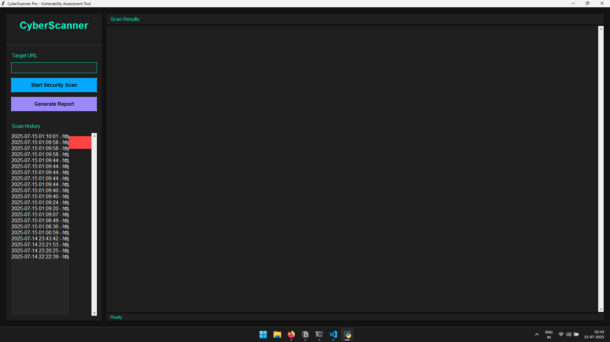
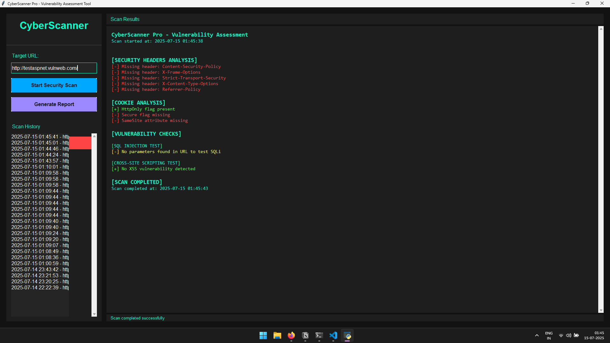

# 🔐 CyberScanner – GUI-Based Web Vulnerability Scanner

**CyberScanner** is a powerful desktop-based cybersecurity tool that scans websites for common web vulnerabilities using a clean and interactive Python GUI.

---

## 🧠 Features

- ✅ GUI interface built with Tkinter
- ✅ Enter and scan any HTTP/HTTPS website
- ✅ Detects:
  - Missing HTTP security headers
  - Insecure cookie flags (`HttpOnly`, `Secure`)
  - Basic SQL Injection vulnerabilities
  - Basic reflected Cross-Site Scripting (XSS)
- ✅ Color-coded results (green for safe, red for vulnerable)
- ✅ Scan history saved locally
- ✅ Export results to TXT, JSON, CSV, and HTML
- ✅ Clear scan history with one click
- ✅ Built for educational and ethical testing

---

## 🖼️ Screenshots

### Main GUI  


### Scan Results  


---

## ⚙️ How to Run

### 1. Clone the repository
```bash
git clone https://github.com/KINGSMAN3105/CYBER-SCANNER/
cd cyber-scanner
```

### 2. Install the required Python package
```bash
pip install -r requirements.txt
```

### 3. Run the tool
```bash
python cyber_scanner.py
```

---

## 📂 Project Structure

```
cyber-scanner/
├── cyber_scanner.py         # Main application file
├── requirements.txt         # Required package list
├── README.md                # Project documentation
└── screenshots/             # UI and scan result images
```

---

## 📢 Disclaimer

> This tool is created for **educational and ethical purposes only**.
> Do not use it to scan websites without proper authorization.

---

## 👤 Author

Name: Vaidik Parmar 
GitHub: [github.com/KINGSMAN3105](https://github.com/KINGSMAN3105)

---

## 🚀 Contributions

Feel free to fork the project, improve it, and submit pull requests. Feedback and improvements are welcome!
